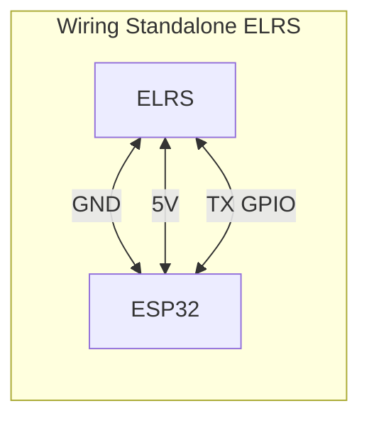
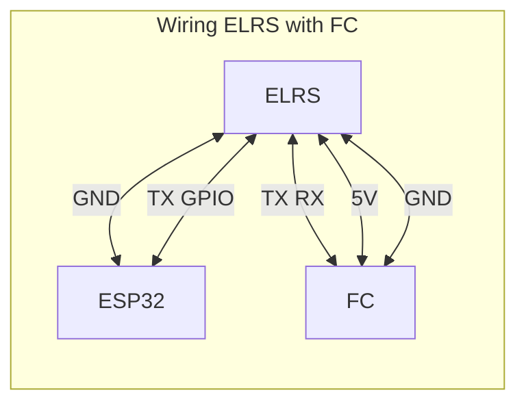

# CRSF & IBus Protocol Decoder Using ESP32

### **Hardware**
| **Protocol**       | **Reciever Type** | **Description**                                   |
|------------------|---------------------------|---------------------------------------------------|
| **CRSF**      | ExpressLRS                | an open-source RC link protocol that uses LoRa modulation for high update rates (up to 1000Hz), ultra-low latency (~3ms), and long-range communication over 2.4GHz or 900MHz frequencies. |
| **IBus**       | Flysky FS-IA6B                | a digital serial communication protocol developed by FlySky for RC receivers, transmitting up to 18 channels of control data at 115200 baud with low latency over a single bi-directional UART line |

---
### **Wiring Diagram**

